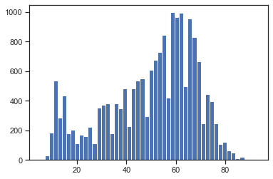
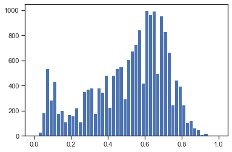
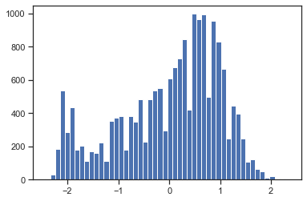
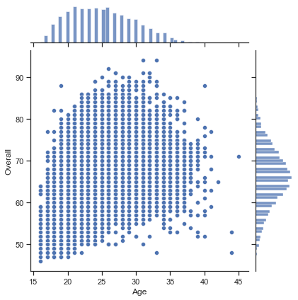
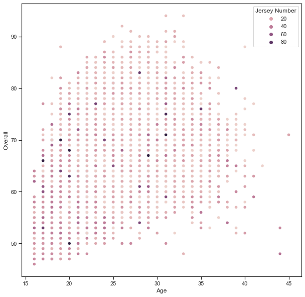

# РК ИУ5-61Б

### Импорт библиотек


```python
import numpy as np
import pandas as pd
import seaborn as sns
import matplotlib.pyplot as plt
from pandas.plotting import scatter_matrix
from sklearn.impute import SimpleImputer
from sklearn.impute import MissingIndicator
import warnings
warnings.filterwarnings('ignore')
sns.set(style="ticks")
%matplotlib inline
```


```python
data = pd.read_csv('data.csv')
```


```python
data.head()
```


<div>
<table border="1" class="dataframe">
  <thead>
    <tr style="text-align: right;">
      <th></th>
      <th>Unnamed: 0</th>
      <th>ID</th>
      <th>Name</th>
      <th>Age</th>
      <th>Photo</th>
      <th>Nationality</th>
      <th>Flag</th>
      <th>Overall</th>
      <th>Potential</th>
      <th>Club</th>
      <th>...</th>
      <th>Composure</th>
      <th>Marking</th>
      <th>StandingTackle</th>
      <th>SlidingTackle</th>
      <th>GKDiving</th>
      <th>GKHandling</th>
      <th>GKKicking</th>
      <th>GKPositioning</th>
      <th>GKReflexes</th>
      <th>Release Clause</th>
    </tr>
  </thead>
  <tbody>
    <tr>
      <th>0</th>
      <td>0</td>
      <td>158023</td>
      <td>L. Messi</td>
      <td>31</td>
      <td>https://cdn.sofifa.org/players/4/19/158023.png</td>
      <td>Argentina</td>
      <td>https://cdn.sofifa.org/flags/52.png</td>
      <td>94</td>
      <td>94</td>
      <td>FC Barcelona</td>
      <td>...</td>
      <td>96.0</td>
      <td>33.0</td>
      <td>28.0</td>
      <td>26.0</td>
      <td>6.0</td>
      <td>11.0</td>
      <td>15.0</td>
      <td>14.0</td>
      <td>8.0</td>
      <td>€226.5M</td>
    </tr>
    <tr>
      <th>1</th>
      <td>1</td>
      <td>20801</td>
      <td>Cristiano Ronaldo</td>
      <td>33</td>
      <td>https://cdn.sofifa.org/players/4/19/20801.png</td>
      <td>Portugal</td>
      <td>https://cdn.sofifa.org/flags/38.png</td>
      <td>94</td>
      <td>94</td>
      <td>Juventus</td>
      <td>...</td>
      <td>95.0</td>
      <td>28.0</td>
      <td>31.0</td>
      <td>23.0</td>
      <td>7.0</td>
      <td>11.0</td>
      <td>15.0</td>
      <td>14.0</td>
      <td>11.0</td>
      <td>€127.1M</td>
    </tr>
    <tr>
      <th>2</th>
      <td>2</td>
      <td>190871</td>
      <td>Neymar Jr</td>
      <td>26</td>
      <td>https://cdn.sofifa.org/players/4/19/190871.png</td>
      <td>Brazil</td>
      <td>https://cdn.sofifa.org/flags/54.png</td>
      <td>92</td>
      <td>93</td>
      <td>Paris Saint-Germain</td>
      <td>...</td>
      <td>94.0</td>
      <td>27.0</td>
      <td>24.0</td>
      <td>33.0</td>
      <td>9.0</td>
      <td>9.0</td>
      <td>15.0</td>
      <td>15.0</td>
      <td>11.0</td>
      <td>€228.1M</td>
    </tr>
    <tr>
      <th>3</th>
      <td>3</td>
      <td>193080</td>
      <td>De Gea</td>
      <td>27</td>
      <td>https://cdn.sofifa.org/players/4/19/193080.png</td>
      <td>Spain</td>
      <td>https://cdn.sofifa.org/flags/45.png</td>
      <td>91</td>
      <td>93</td>
      <td>Manchester United</td>
      <td>...</td>
      <td>68.0</td>
      <td>15.0</td>
      <td>21.0</td>
      <td>13.0</td>
      <td>90.0</td>
      <td>85.0</td>
      <td>87.0</td>
      <td>88.0</td>
      <td>94.0</td>
      <td>€138.6M</td>
    </tr>
    <tr>
      <th>4</th>
      <td>4</td>
      <td>192985</td>
      <td>K. De Bruyne</td>
      <td>27</td>
      <td>https://cdn.sofifa.org/players/4/19/192985.png</td>
      <td>Belgium</td>
      <td>https://cdn.sofifa.org/flags/7.png</td>
      <td>91</td>
      <td>92</td>
      <td>Manchester City</td>
      <td>...</td>
      <td>88.0</td>
      <td>68.0</td>
      <td>58.0</td>
      <td>51.0</td>
      <td>15.0</td>
      <td>13.0</td>
      <td>5.0</td>
      <td>10.0</td>
      <td>13.0</td>
      <td>€196.4M</td>
    </tr>
  </tbody>
</table>
<p>5 rows × 89 columns</p>
</div>


```python
data.dtypes
```


    Unnamed: 0          int64
    ID                  int64
    Name               object
    Age                 int64
    Photo              object
                       ...   
    GKHandling        float64
    GKKicking         float64
    GKPositioning     float64
    GKReflexes        float64
    Release Clause     object
    Length: 89, dtype: object


```python
data.isnull().sum()
# проверим есть ли пропущенные значения
```


    Unnamed: 0           0
    ID                   0
    Name                 0
    Age                  0
    Photo                0
                      ... 
    GKHandling          48
    GKKicking           48
    GKPositioning       48
    GKReflexes          48
    Release Clause    1564
    Length: 89, dtype: int64


```python
data.info()
```

    <class 'pandas.core.frame.DataFrame'>
    RangeIndex: 18207 entries, 0 to 18206
    Data columns (total 89 columns):
     #   Column                    Non-Null Count  Dtype  
    ---  ------                    --------------  -----  
     0   Unnamed: 0                18207 non-null  int64  
     1   ID                        18207 non-null  int64  
     2   Name                      18207 non-null  object 
     3   Age                       18207 non-null  int64  
     4   Photo                     18207 non-null  object 
     5   Nationality               18207 non-null  object 
     6   Flag                      18207 non-null  object 
     7   Overall                   18207 non-null  int64  
     8   Potential                 18207 non-null  int64  
     9   Club                      17966 non-null  object 
     10  Club Logo                 18207 non-null  object 
     11  Value                     18207 non-null  object 
     12  Wage                      18207 non-null  object 
     13  Special                   18207 non-null  int64  
     14  Preferred Foot            18159 non-null  object 
     15  International Reputation  18159 non-null  float64
     16  Weak Foot                 18159 non-null  float64
     17  Skill Moves               18159 non-null  float64
     18  Work Rate                 18159 non-null  object 
     19  Body Type                 18159 non-null  object 
     20  Real Face                 18159 non-null  object 
     21  Position                  18147 non-null  object 
     22  Jersey Number             18147 non-null  float64
     23  Joined                    16654 non-null  object 
     24  Loaned From               1264 non-null   object 
     25  Contract Valid Until      17918 non-null  object 
     26  Height                    18159 non-null  object 
     27  Weight                    18159 non-null  object 
     28  LS                        16122 non-null  object 
     29  ST                        16122 non-null  object 
     30  RS                        16122 non-null  object 
     31  LW                        16122 non-null  object 
     32  LF                        16122 non-null  object 
     33  CF                        16122 non-null  object 
     34  RF                        16122 non-null  object 
     35  RW                        16122 non-null  object 
     36  LAM                       16122 non-null  object 
     37  CAM                       16122 non-null  object 
     38  RAM                       16122 non-null  object 
     39  LM                        16122 non-null  object 
     40  LCM                       16122 non-null  object 
     41  CM                        16122 non-null  object 
     42  RCM                       16122 non-null  object 
     43  RM                        16122 non-null  object 
     44  LWB                       16122 non-null  object 
     45  LDM                       16122 non-null  object 
     46  CDM                       16122 non-null  object 
     47  RDM                       16122 non-null  object 
     48  RWB                       16122 non-null  object 
     49  LB                        16122 non-null  object 
     50  LCB                       16122 non-null  object 
     51  CB                        16122 non-null  object 
     52  RCB                       16122 non-null  object 
     53  RB                        16122 non-null  object 
     54  Crossing                  18159 non-null  float64
     55  Finishing                 18159 non-null  float64
     56  HeadingAccuracy           18159 non-null  float64
     57  ShortPassing              18159 non-null  float64
     58  Volleys                   18159 non-null  float64
     59  Dribbling                 18159 non-null  float64
     60  Curve                     18159 non-null  float64
     61  FKAccuracy                18159 non-null  float64
     62  LongPassing               18159 non-null  float64
     63  BallControl               18159 non-null  float64
     64  Acceleration              18159 non-null  float64
     65  SprintSpeed               18159 non-null  float64
     66  Agility                   18159 non-null  float64
     67  Reactions                 18159 non-null  float64
     68  Balance                   18159 non-null  float64
     69  ShotPower                 18159 non-null  float64
     70  Jumping                   18159 non-null  float64
     71  Stamina                   18159 non-null  float64
     72  Strength                  18159 non-null  float64
     73  LongShots                 18159 non-null  float64
     74  Aggression                18159 non-null  float64
     75  Interceptions             18159 non-null  float64
     76  Positioning               18159 non-null  float64
     77  Vision                    18159 non-null  float64
     78  Penalties                 18159 non-null  float64
     79  Composure                 18159 non-null  float64
     80  Marking                   18159 non-null  float64
     81  StandingTackle            18159 non-null  float64
     82  SlidingTackle             18159 non-null  float64
     83  GKDiving                  18159 non-null  float64
     84  GKHandling                18159 non-null  float64
     85  GKKicking                 18159 non-null  float64
     86  GKPositioning             18159 non-null  float64
     87  GKReflexes                18159 non-null  float64
     88  Release Clause            16643 non-null  object 
    dtypes: float64(38), int64(6), object(45)
    memory usage: 12.4+ MB


```python
from sklearn.preprocessing import MinMaxScaler, StandardScaler, Normalizer
```


```python
sc1 = MinMaxScaler()
sc1_data = sc1.fit_transform(data[['Crossing']])
```


```python
plt.hist(data['Crossing'], 50)
plt.show()
```


    

    


```python
plt.hist(sc1_data, 50)
plt.show()
```


    

    


### Масштабирование данных на основе Z-оценки - StandardScaler¶


```python
sc2 = StandardScaler()
sc2_data = sc2.fit_transform(data[['Crossing']])
```


```python
plt.hist(sc2_data, 50)
plt.show()
```


    

    


```python
cat_temp_data = data[['Club']]
cat_temp_data.head()
```


<div>
<style scoped>
    .dataframe tbody tr th:only-of-type {
        vertical-align: middle;
    }

    .dataframe tbody tr th {
        vertical-align: top;
    }

    .dataframe thead th {
        text-align: right;
    }
</style>
<table border="1" class="dataframe">
  <thead>
    <tr style="text-align: right;">
      <th></th>
      <th>Club</th>
    </tr>
  </thead>
  <tbody>
    <tr>
      <th>0</th>
      <td>FC Barcelona</td>
    </tr>
    <tr>
      <th>1</th>
      <td>Juventus</td>
    </tr>
    <tr>
      <th>2</th>
      <td>Paris Saint-Germain</td>
    </tr>
    <tr>
      <th>3</th>
      <td>Manchester United</td>
    </tr>
    <tr>
      <th>4</th>
      <td>Manchester City</td>
    </tr>
  </tbody>
</table>
</div>


```python
# Импьютация наиболее частыми значениями
imp2 = SimpleImputer(missing_values=np.nan, strategy='most_frequent')
data_imp2 = imp2.fit_transform(cat_temp_data)
data_imp2
```


    array([['FC Barcelona'],
           ['Juventus'],
           ['Paris Saint-Germain'],
           ...,
           ['Cambridge United'],
           ['Tranmere Rovers'],
           ['Tranmere Rovers']], dtype=object)


```python
cat_enc = pd.DataFrame({'Club':data_imp2.T[0]})
cat_enc
```


<div>
<style scoped>
    .dataframe tbody tr th:only-of-type {
        vertical-align: middle;
    }

    .dataframe tbody tr th {
        vertical-align: top;
    }

    .dataframe thead th {
        text-align: right;
    }
</style>
<table border="1" class="dataframe">
  <thead>
    <tr style="text-align: right;">
      <th></th>
      <th>Club</th>
    </tr>
  </thead>
  <tbody>
    <tr>
      <th>0</th>
      <td>FC Barcelona</td>
    </tr>
    <tr>
      <th>1</th>
      <td>Juventus</td>
    </tr>
    <tr>
      <th>2</th>
      <td>Paris Saint-Germain</td>
    </tr>
    <tr>
      <th>3</th>
      <td>Manchester United</td>
    </tr>
    <tr>
      <th>4</th>
      <td>Manchester City</td>
    </tr>
    <tr>
      <th>...</th>
      <td>...</td>
    </tr>
    <tr>
      <th>18202</th>
      <td>Crewe Alexandra</td>
    </tr>
    <tr>
      <th>18203</th>
      <td>Trelleborgs FF</td>
    </tr>
    <tr>
      <th>18204</th>
      <td>Cambridge United</td>
    </tr>
    <tr>
      <th>18205</th>
      <td>Tranmere Rovers</td>
    </tr>
    <tr>
      <th>18206</th>
      <td>Tranmere Rovers</td>
    </tr>
  </tbody>
</table>
<p>18207 rows × 1 columns</p>
</div>


```python
from sklearn.preprocessing import LabelEncoder, OneHotEncoder
```

### Кодирование категорий целочисленными значениями - label encoding


```python
le = LabelEncoder()
cat_enc_le = le.fit_transform(cat_enc['Club'])
```


```python
cat_enc['Club'].unique()
```


    array(['FC Barcelona', 'Juventus', 'Paris Saint-Germain',
           'Manchester United', 'Manchester City', 'Chelsea', 'Real Madrid',
           'Atlético Madrid', 'FC Bayern München', 'Tottenham Hotspur',
           'Liverpool', 'Napoli', 'Arsenal', 'Milan', 'Inter', 'Lazio',
           'Borussia Dortmund', 'Vissel Kobe', 'Olympique Lyonnais', 'Roma',
           'Valencia CF', 'Guangzhou Evergrande Taobao FC', 'FC Porto',
           'FC Schalke 04', 'Beşiktaş JK', 'LA Galaxy', 'Sporting CP',
           'Real Betis', 'Olympique de Marseille', 'RC Celta',
           'Bayer 04 Leverkusen', 'Real Sociedad', 'Villarreal CF',
           'Sevilla FC', 'SL Benfica', 'AS Saint-Étienne', 'AS Monaco',
           'Leicester City', 'Atalanta', 'Grêmio', 'Atlético Mineiro',
           'RB Leipzig', 'Ajax', 'Dalian YiFang FC', 'Everton',
           'West Ham United', '1. FC Köln', 'TSG 1899 Hoffenheim',
           'Shanghai SIPG FC', 'OGC Nice', 'Al Nassr',
           'Wolverhampton Wanderers', 'Borussia Mönchengladbach',
           'Hertha BSC', 'SV Werder Bremen', 'Cruzeiro',
           'Athletic Club de Bilbao', 'Torino', 'Medipol Başakşehir FK',
           'Beijing Sinobo Guoan FC', 'Crystal Palace', 'PFC CSKA Moscow',
           'VfL Wolfsburg', 'Shakhtar Donetsk', 'Toronto FC',
           'Lokomotiv Moscow', 'Sassuolo', 'New York City FC', 'Fluminense',
           'PSV', 'Levante UD', 'Fulham', 'Watford', 'Atlanta United',
           'Montpellier HSC', 'Galatasaray SK', 'Fenerbahçe SK', 'SD Eibar',
           'Los Angeles FC', 'Sampdoria', 'Al Hilal', 'VfB Stuttgart',
           'SC Braga', 'River Plate', 'Deportivo Alavés',
           'Eintracht Frankfurt', 'Girona FC', 'Guangzhou R&F; FC', 'Burnley',
           'Stoke City', 'Southampton', 'Tianjin Quanjian FC', 'Getafe CF',
           'Beijing Renhe FC', 'Montreal Impact', 'Chievo Verona', 'Genoa',
           'Portland Timbers', 'Tigres U.A.N.L.', 'RCD Espanyol',
           'Hebei China Fortune FC', 'Cagliari', 'Chicago Fire', 'DC United',
           'Sagan Tosu', 'Dynamo Kyiv', 'Santos', 'Internacional',
           'América FC (Minas Gerais)', 'Independiente', 'Boca Juniors',
           'Cruz Azul', '1. FSV Mainz 05', 'Bournemouth', 'Spartak Moscow',
           'Racing Club', 'FC Augsburg', 'Fiorentina', 'FC Nantes',
           'Feyenoord', 'Club Brugge KV', 'Brighton & Hove Albion', 'Al Ahli',
           'Jiangsu Suning FC', 'SC Freiburg', 'PAOK', 'Stade Rennais FC',
           'Trabzonspor', 'SPAL', 'Portimonense SC', 'Olympiacos CFP',
           'Club Atlético Huracán', 'Kasimpaşa SK', 'Newcastle United',
           'Frosinone', 'Querétaro', 'KRC Genk', 'Hannover 96',
           'Stade Malherbe Caen', 'Godoy Cruz', 'Toulouse Football Club',
           'RSC Anderlecht', 'Huddersfield Town', 'CD Tondela',
           'Seattle Sounders FC', 'Hamburger SV', 'FC Red Bull Salzburg',
           'Rio Ave FC', 'FC Girondins de Bordeaux', 'Melbourne Victory',
           'Parma', 'FC Basel 1893', 'Al Wehda', 'BSC Young Boys', 'KAA Gent',
           'Al Ittihad', 'Standard de Liège', 'Shanghai Greenland Shenhua FC',
           'Colo-Colo', 'Junior FC', 'West Bromwich Albion',
           'RC Strasbourg Alsace', 'Göztepe SK', 'Deportivo Cali',
           'Deportivo Toluca', 'Bologna', 'Nagoya Grampus', 'Amiens SC',
           'Changchun Yatai FC', 'Club Atlético Lanús', 'Botafogo',
           'Club América', 'Udinese', 'Real Valladolid CF', 'CD Leganés',
           'Club Atlético Banfield', 'Celtic', 'Vitória Guimarães',
           'FC København', 'UD Las Palmas', 'Deportivo de La Coruña',
           'Universidad Católica', 'San Lorenzo de Almagro', 'Rayo Vallecano',
           'Monterrey', 'Columbus Crew SC', 'MKE Ankaragücü',
           'Guizhou Hengfeng FC', 'Swansea City', 'Tianjin TEDA FC',
           'Chongqing Dangdai Lifan FC SWM Team', 'AEK Athens', 'Al Taawoun',
           'Melbourne City FC', 'En Avant de Guingamp',
           'Akhisar Belediyespor', 'Foggia', 'LOSC Lille', '1. FC Nürnberg',
           'Clube Sport Marítimo', 'Real Sporting de Gijón', 'BB Erzurumspor',
           'Shandong Luneng TaiShan FC', 'Club Atlético Colón', 'Bahia',
           'Once Caldas', 'FC Groningen', 'Angers SCO', 'Paraná',
           'Antalyaspor', 'Minnesota United FC', 'Club León', 'Empoli',
           'VVV-Venlo', 'Leeds United', 'Viktoria Plzeň', 'Alanyaspor',
           'Atlético Paranaense', 'Derby County', 'Kawasaki Frontale',
           'Cardiff City', 'Aston Villa', 'Guadalajara', 'Dijon FCO',
           'Santos Laguna', 'Málaga CF', 'Vitória', 'Çaykur Rizespor',
           'U.N.A.M.', 'Nottingham Forest', 'Royal Antwerp FC',
           'Club Tijuana', 'Sport Club do Recife', 'Real Salt Lake',
           'AZ Alkmaar', 'SK Slavia Praha', 'Willem II', 'Middlesbrough',
           'Dinamo Zagreb', 'Club Atlas', 'Granada CF', 'Sydney FC',
           'Sporting Kansas City', 'SV Zulte-Waregem', 'Philadelphia Union',
           'Real Oviedo', 'Pachuca', 'Boavista FC', 'Atiker Konyaspor',
           'Kaizer Chiefs', 'GD Chaves', 'Palermo', 'Atlético Nacional',
           'Puebla FC', 'Perth Glory', 'Panathinaikos FC', 'FC Sion',
           'Vitória de Setúbal', 'New York Red Bulls', 'Al Shabab',
           'Monarcas Morelia', 'Albacete BP', 'Rangers FC', 'Sparta Praha',
           'Legia Warszawa', 'Urawa Red Diamonds', 'Rosario Central',
           'Stade de Reims', 'ADO Den Haag', 'Chapecoense', 'FC Midtjylland',
           'San Jose Earthquakes', 'Belgrano de Córdoba', 'Brescia',
           'Kashima Antlers', 'CD Everton de Viña del Mar',
           'Fortuna Düsseldorf', 'SD Huesca', 'Preston North End',
           'Club Atlético Talleres', 'Benevento', 'Vitesse',
           'Gimnasia y Esgrima La Plata', 'Houston Dynamo', 'Club Necaxa',
           'Norwich City', 'Holstein Kiel', 'Ettifaq FC', 'Kayserispor',
           '1. FC Heidenheim 1846', 'Brentford', 'Yeni Malatyaspor',
           'Lobos BUAP', 'Bursaspor', 'Ceará Sporting Club',
           'Sheffield United', 'FC Ingolstadt 04', 'Estudiantes de La Plata',
           'AIK', 'Queens Park Rangers', 'Suwon Samsung Bluewings',
           'Heart of Midlothian', 'Reading', 'FC Dallas', 'Heracles Almelo',
           'Venezia FC', 'CD Lugo', 'Henan Jianye FC', 'Orlando City SC',
           'CA Osasuna', 'NAC Breda', 'Livorno', 'Universidad de Chile',
           'Brøndby IF', 'Aberdeen', 'Defensa y Justicia', 'Atlético Tucumán',
           'Blackburn Rovers', 'SV Darmstadt 98', 'Moreirense FC',
           'Sanfrecce Hiroshima', 'CD Numancia', 'KV Oostende', 'FC Utrecht',
           'Vancouver Whitecaps FC', 'Odense Boldklub', 'SC Heerenveen',
           'Racing Club de Lens', 'Independiente Santa Fe',
           'Sporting de Charleroi', 'Millonarios FC', 'Sheffield Wednesday',
           'Perugia', 'Daegu FC', 'Vélez Sarsfield',
           'Grasshopper Club Zürich', 'Sivasspor', 'Nîmes Olympique',
           'Rosenborg BK', 'SK Sturm Graz', 'FC Metz',
           'CD Universidad de Concepción', 'Hellas Verona', 'Brisbane Roar',
           'CD Feirense', 'Hull City', 'Waasland-Beveren', 'Neuchâtel Xamax',
           'Real Zaragoza', 'CD Aves', 'Millwall', 'Unión de Santa Fe',
           'KAS Eupen', 'Cádiz CF', 'FC Tokyo', 'CD Tenerife',
           '1. FC Union Berlin', 'Al Fayha', 'AJ Auxerre',
           'Patriotas Boyacá FC', 'Molde FK', 'Bristol City', 'CD Nacional',
           'Sporting Lokeren', 'FC St. Pauli', 'Deportes Iquique',
           'Al Qadisiyah', 'Atlético Bucaramanga', 'Club Atlético Tigre',
           'FK Austria Wien', 'Patronato', 'Malmö FF', 'Kashiwa Reysol',
           'US Cremonese', 'VfL Bochum 1848', 'SK Rapid Wien',
           'KSV Cercle Brugge', 'Rionegro Águilas', 'Gimnàstic de Tarragona',
           'Lecce', 'Santa Clara', 'BK Häcken', 'New England Revolution',
           'Orlando Pirates', 'Atlético Huila', 'Western Sydney Wanderers',
           'Kalmar FF', 'Independiente Medellín', 'Fortuna Sittard',
           'Lech Poznań', 'Djurgårdens IF', 'CF Reus Deportiu', 'SK Brann',
           'Ulsan Hyundai FC', 'Sint-Truidense VV', 'Carpi', 'Al Fateh',
           'Royal Excel Mouscron', 'AC Ajaccio', 'PEC Zwolle', 'Sunderland',
           'Club Atlético Aldosivi', 'US Salernitana 1919', 'FC Lorient',
           'Argentinos Juniors', 'AD Alcorcón', 'Crotone', 'Excelsior',
           'KV Kortrijk', 'IFK Norrköping', 'Adelaide United',
           'FC St. Gallen', 'Tiburones Rojos de Veracruz', 'CD Palestino',
           'Jeju United FC', 'Deportes Tolima', 'Jeonbuk Hyundai Motors',
           'Birmingham City', 'América de Cali', 'La Equidad', 'Spezia',
           'Aalborg BK', 'Le Havre AC', 'Górnik Zabrze',
           'Central Coast Mariners', 'Wigan Athletic',
           'Jagiellonia Białystok', 'Cittadella', 'Hibernian', 'FC Lugano',
           'San Martín de San Juan', 'Strømsgodset IF', 'Júbilo Iwata',
           "Newell's Old Boys", 'Al Faisaly', 'Colorado Rapids',
           'IF Elfsborg', 'SV Sandhausen', 'Al Batin', 'Stade Brestois 29',
           'UD Almería', 'Gyeongnam FC', 'Yokohama F. Marinos', 'Kilmarnock',
           'Pescara', 'Newcastle Jets', 'Córdoba CF', 'RCD Mallorca',
           'Hammarby IF', 'Cerezo Osaka', 'KFC Uerdingen 05',
           'Shimizu S-Pulse', 'MSV Duisburg', 'Os Belenenses',
           'DSC Arminia Bielefeld', 'Ipswich Town', 'FC Seoul',
           'Lechia Gdańsk', 'Gamba Osaka', 'CF Rayo Majadahonda', 'LASK Linz',
           'Bolton Wanderers', 'Al Raed', 'Extremadura UD', 'SC Paderborn 07',
           'Wellington Phoenix', 'Unión Española', 'Alianza Petrolera',
           'Cracovia', 'Gangwon FC', 'Elche CF', 'ESTAC Troyes', 'AS Béziers',
           'La Berrichonne de Châteauroux', 'Clermont Foot 63',
           '1. FC Magdeburg', 'Pohang Steelers', 'Örebro SK', 'Arka Gdynia',
           'SG Dynamo Dresden', 'SpVgg Greuther Fürth', 'CD Huachipato',
           'Wisła Kraków', 'Stabæk Fotball', 'Eintracht Braunschweig',
           'Valenciennes FC', 'FC Thun', 'San Luis de Quillota',
           ' SSV Jahn Regensburg', 'Cosenza', 'FC Nordsjælland',
           'FC Erzgebirge Aue', 'Jeonnam Dragons', 'Wolfsberger AC',
           'Chamois Niortais Football Club', 'Club Deportes Temuco',
           'AS Nancy Lorraine', 'Red Star FC', 'Al Hazem', 'Pogoń Szczecin',
           'Charlton Athletic', 'Grenoble Foot 38', 'FC Hansa Rostock',
           'San Martin de Tucumán', 'Incheon United FC', 'Śląsk Wrocław',
           'GFC Ajaccio', '1. FC Kaiserslautern', 'Deportivo Pasto',
           'Lincoln City', 'Motherwell', 'Rotherham United', 'Burton Albion',
           'Wisła Płock', 'FC Wacker Innsbruck', 'Peterborough United',
           'Ascoli', 'FC Zürich', 'Fleetwood Town', 'Padova',
           'FC Sochaux-Montbéliard', 'SV Wehen Wiesbaden', 'Unión La Calera',
           'Scunthorpe United', "CD O'Higgins", 'CD Antofagasta',
           'Plymouth Argyle', 'Aarhus GF', 'Lillestrøm SK', 'Karlsruher SC',
           'GIF Sundsvall', 'FC Emmen', 'Barnsley', 'Audax Italiano',
           'V-Varen Nagasaki', 'Paris FC', 'SpVgg Unterhaching', 'Hobro IK',
           'De Graafschap', 'Hokkaido Consadole Sapporo', 'Tromsø IL',
           'FC Luzern', 'FK Haugesund', 'Zagłębie Lubin', 'VfR Aalen',
           'Dundalk', 'Oxford United', 'Piast Gliwice', 'Ohod Club',
           'Östersunds FK', 'Vegalta Sendai', 'Crawley Town',
           'FC Admira Wacker Mödling', 'Vålerenga Fotball', 'Dundee FC',
           'Portsmouth', 'Envigado FC', 'Miedź Legnica', 'Odds BK',
           'SC Fortuna Köln', 'US Orléans Loiret Football', 'Sarpsborg 08 FF',
           'Jaguares de Córdoba', 'Bradford City', 'Accrington Stanley',
           'St. Johnstone FC', 'Boyacá Chicó FC', 'Luton Town',
           'SV Mattersburg', 'Kristiansund BK', 'Sangju Sangmu FC',
           'Rochdale', 'Walsall', 'Korona Kielce', 'Shonan Bellmare',
           'FC Würzburger Kickers', 'FSV Zwickau', 'St. Mirren', 'AC Horsens',
           'Esbjerg fB', 'HJK Helsinki', 'Southend United', 'Bristol Rovers',
           'Hamilton Academical FC', 'TSV 1860 München', 'Curicó Unido',
           'SCR Altach', 'Ranheim Fotball', 'Stevenage',
           'SG Sonnenhof Großaspach', 'Oldham Athletic', 'Milton Keynes Dons',
           'FK Bodø/Glimt', 'SC Preußen Münster', 'Wycombe Wanderers',
           'Vejle Boldklub', 'Bury', 'Randers FC', 'VfL Osnabrück',
           'SønderjyskE', 'IFK Göteborg', 'Mansfield Town', 'Coventry City',
           'Waterford FC', 'Shrewsbury', 'IK Start', 'Gillingham',
           'FC Energie Cottbus', 'FC Carl Zeiss Jena', 'Hallescher FC',
           'SV Meppen', 'AFC Wimbledon', 'Blackpool', 'Doncaster Rovers',
           'Sandefjord Fotball', 'VfL Sportfreunde Lotte', 'Cheltenham Town',
           'IK Sirius', 'Vendsyssel FF', 'Swindon Town', 'Notts County',
           'SKN St. Pölten', 'Exeter City', 'Northampton Town',
           'Shamrock Rovers', 'Colchester United', 'Livingston FC',
           'TSV Hartberg', 'Tranmere Rovers', 'Cambridge United',
           'Grimsby Town', 'Port Vale', 'Itagüí Leones FC',
           'Forest Green Rovers', 'Dalkurd FF', 'Zagłębie Sosnowiec',
           'Carlisle United', 'Trelleborgs FF', "St. Patrick's Athletic",
           'Morecambe', 'Cork City', 'IF Brommapojkarna', 'Crewe Alexandra',
           'Yeovil Town', 'Bohemian FC', 'Macclesfield Town',
           'Newport County', 'Sligo Rovers', 'Derry City', 'Limerick FC',
           'Bray Wanderers'], dtype=object)


```python
np.unique(cat_enc_le)
```


    array([  0,   1,   2,   3,   4,   5,   6,   7,   8,   9,  10,  11,  12,
            13,  14,  15,  16,  17,  18,  19,  20,  21,  22,  23,  24,  25,
            26,  27,  28,  29,  30,  31,  32,  33,  34,  35,  36,  37,  38,
            39,  40,  41,  42,  43,  44,  45,  46,  47,  48,  49,  50,  51,
            52,  53,  54,  55,  56,  57,  58,  59,  60,  61,  62,  63,  64,
            65,  66,  67,  68,  69,  70,  71,  72,  73,  74,  75,  76,  77,
            78,  79,  80,  81,  82,  83,  84,  85,  86,  87,  88,  89,  90,
            91,  92,  93,  94,  95,  96,  97,  98,  99, 100, 101, 102, 103,
           104, 105, 106, 107, 108, 109, 110, 111, 112, 113, 114, 115, 116,
           117, 118, 119, 120, 121, 122, 123, 124, 125, 126, 127, 128, 129,
           130, 131, 132, 133, 134, 135, 136, 137, 138, 139, 140, 141, 142,
           143, 144, 145, 146, 147, 148, 149, 150, 151, 152, 153, 154, 155,
           156, 157, 158, 159, 160, 161, 162, 163, 164, 165, 166, 167, 168,
           169, 170, 171, 172, 173, 174, 175, 176, 177, 178, 179, 180, 181,
           182, 183, 184, 185, 186, 187, 188, 189, 190, 191, 192, 193, 194,
           195, 196, 197, 198, 199, 200, 201, 202, 203, 204, 205, 206, 207,
           208, 209, 210, 211, 212, 213, 214, 215, 216, 217, 218, 219, 220,
           221, 222, 223, 224, 225, 226, 227, 228, 229, 230, 231, 232, 233,
           234, 235, 236, 237, 238, 239, 240, 241, 242, 243, 244, 245, 246,
           247, 248, 249, 250, 251, 252, 253, 254, 255, 256, 257, 258, 259,
           260, 261, 262, 263, 264, 265, 266, 267, 268, 269, 270, 271, 272,
           273, 274, 275, 276, 277, 278, 279, 280, 281, 282, 283, 284, 285,
           286, 287, 288, 289, 290, 291, 292, 293, 294, 295, 296, 297, 298,
           299, 300, 301, 302, 303, 304, 305, 306, 307, 308, 309, 310, 311,
           312, 313, 314, 315, 316, 317, 318, 319, 320, 321, 322, 323, 324,
           325, 326, 327, 328, 329, 330, 331, 332, 333, 334, 335, 336, 337,
           338, 339, 340, 341, 342, 343, 344, 345, 346, 347, 348, 349, 350,
           351, 352, 353, 354, 355, 356, 357, 358, 359, 360, 361, 362, 363,
           364, 365, 366, 367, 368, 369, 370, 371, 372, 373, 374, 375, 376,
           377, 378, 379, 380, 381, 382, 383, 384, 385, 386, 387, 388, 389,
           390, 391, 392, 393, 394, 395, 396, 397, 398, 399, 400, 401, 402,
           403, 404, 405, 406, 407, 408, 409, 410, 411, 412, 413, 414, 415,
           416, 417, 418, 419, 420, 421, 422, 423, 424, 425, 426, 427, 428,
           429, 430, 431, 432, 433, 434, 435, 436, 437, 438, 439, 440, 441,
           442, 443, 444, 445, 446, 447, 448, 449, 450, 451, 452, 453, 454,
           455, 456, 457, 458, 459, 460, 461, 462, 463, 464, 465, 466, 467,
           468, 469, 470, 471, 472, 473, 474, 475, 476, 477, 478, 479, 480,
           481, 482, 483, 484, 485, 486, 487, 488, 489, 490, 491, 492, 493,
           494, 495, 496, 497, 498, 499, 500, 501, 502, 503, 504, 505, 506,
           507, 508, 509, 510, 511, 512, 513, 514, 515, 516, 517, 518, 519,
           520, 521, 522, 523, 524, 525, 526, 527, 528, 529, 530, 531, 532,
           533, 534, 535, 536, 537, 538, 539, 540, 541, 542, 543, 544, 545,
           546, 547, 548, 549, 550, 551, 552, 553, 554, 555, 556, 557, 558,
           559, 560, 561, 562, 563, 564, 565, 566, 567, 568, 569, 570, 571,
           572, 573, 574, 575, 576, 577, 578, 579, 580, 581, 582, 583, 584,
           585, 586, 587, 588, 589, 590, 591, 592, 593, 594, 595, 596, 597,
           598, 599, 600, 601, 602, 603, 604, 605, 606, 607, 608, 609, 610,
           611, 612, 613, 614, 615, 616, 617, 618, 619, 620, 621, 622, 623,
           624, 625, 626, 627, 628, 629, 630, 631, 632, 633, 634, 635, 636,
           637, 638, 639, 640, 641, 642, 643, 644, 645, 646, 647, 648, 649,
           650])


```python
le.inverse_transform([0, 1, 2, 3])
```


    array([' SSV Jahn Regensburg', '1. FC Heidenheim 1846',
           '1. FC Kaiserslautern', '1. FC Köln'], dtype=object)


### Кодирование категорий наборами бинарных значений - one-hot encoding


```python
ohe = OneHotEncoder()
cat_enc_ohe = ohe.fit_transform(cat_enc[['Club']])
```


```python
cat_enc.shape
```


    (18207, 1)


```python
cat_enc_ohe.shape
```


    (18207, 651)


```python
cat_enc_ohe
```


    <18207x651 sparse matrix of type '<class 'numpy.float64'>'
    	with 18207 stored elements in Compressed Sparse Row format>


```python
cat_enc_ohe.todense()[0:10]
```


    matrix([[0., 0., 0., ..., 0., 0., 0.],
            [0., 0., 0., ..., 0., 0., 0.],
            [0., 0., 0., ..., 0., 0., 0.],
            ...,
            [0., 0., 0., ..., 0., 0., 0.],
            [0., 0., 0., ..., 0., 0., 0.],
            [0., 0., 0., ..., 0., 0., 0.]])


```python
cat_enc.head(10)
```


<div>
<style scoped>
    .dataframe tbody tr th:only-of-type {
        vertical-align: middle;
    }

    .dataframe tbody tr th {
        vertical-align: top;
    }

    .dataframe thead th {
        text-align: right;
    }
</style>
<table border="1" class="dataframe">
  <thead>
    <tr style="text-align: right;">
      <th></th>
      <th>Club</th>
    </tr>
  </thead>
  <tbody>
    <tr>
      <th>0</th>
      <td>FC Barcelona</td>
    </tr>
    <tr>
      <th>1</th>
      <td>Juventus</td>
    </tr>
    <tr>
      <th>2</th>
      <td>Paris Saint-Germain</td>
    </tr>
    <tr>
      <th>3</th>
      <td>Manchester United</td>
    </tr>
    <tr>
      <th>4</th>
      <td>Manchester City</td>
    </tr>
    <tr>
      <th>5</th>
      <td>Chelsea</td>
    </tr>
    <tr>
      <th>6</th>
      <td>Real Madrid</td>
    </tr>
    <tr>
      <th>7</th>
      <td>FC Barcelona</td>
    </tr>
    <tr>
      <th>8</th>
      <td>Real Madrid</td>
    </tr>
    <tr>
      <th>9</th>
      <td>Atlético Madrid</td>
    </tr>
  </tbody>
</table>
</div>


```python
# Увеличенные диаграммы рассеяния 
sns.jointplot(x = "Age", y = "Overall", kind="scatter", data = data)
```


    <seaborn.axisgrid.JointGrid at 0x7f9f41d95310>


    

    


```python
fig, ax = plt.subplots(figsize=(10,10)) 
sns.scatterplot(ax=ax, x='Age', y='Overall', data=data, hue='Jersey Number')
```


    <AxesSubplot:xlabel='Age', ylabel='Overall'>


    

    

