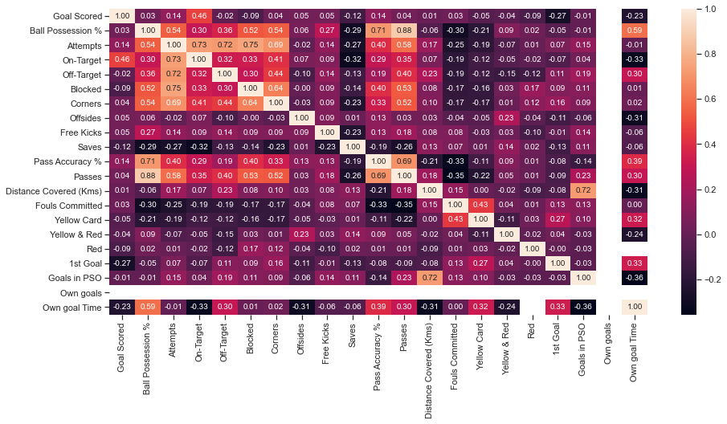

# РК ИУ5-61Б 

### Импорт библиотек


```python
import numpy as np
import pandas as pd
import seaborn as sns
import matplotlib.pyplot as plt
from pandas.plotting import scatter_matrix
import warnings
warnings.filterwarnings('ignore')
sns.set(style="ticks")
%matplotlib inline
from sklearn.model_selection import train_test_split
from sklearn.preprocessing import LabelEncoder
```


```python
data = pd.read_csv('FIFA_2018_Statistics.csv')
```


```python
data.head()
```


<div>
<style scoped>
    .dataframe tbody tr th:only-of-type {
        vertical-align: middle;
    }

    .dataframe tbody tr th {
        vertical-align: top;
    }

    .dataframe thead th {
        text-align: right;
    }
</style>
<table border="1" class="dataframe">
  <thead>
    <tr style="text-align: right;">
      <th></th>
      <th>Date</th>
      <th>Team</th>
      <th>Opponent</th>
      <th>Goal Scored</th>
      <th>Ball Possession %</th>
      <th>Attempts</th>
      <th>On-Target</th>
      <th>Off-Target</th>
      <th>Blocked</th>
      <th>Corners</th>
      <th>...</th>
      <th>Yellow Card</th>
      <th>Yellow &amp; Red</th>
      <th>Red</th>
      <th>Man of the Match</th>
      <th>1st Goal</th>
      <th>Round</th>
      <th>PSO</th>
      <th>Goals in PSO</th>
      <th>Own goals</th>
      <th>Own goal Time</th>
    </tr>
  </thead>
  <tbody>
    <tr>
      <th>0</th>
      <td>14-06-2018</td>
      <td>Russia</td>
      <td>Saudi Arabia</td>
      <td>5</td>
      <td>40</td>
      <td>13</td>
      <td>7</td>
      <td>3</td>
      <td>3</td>
      <td>6</td>
      <td>...</td>
      <td>0</td>
      <td>0</td>
      <td>0</td>
      <td>Yes</td>
      <td>12.0</td>
      <td>Group Stage</td>
      <td>No</td>
      <td>0</td>
      <td>NaN</td>
      <td>NaN</td>
    </tr>
    <tr>
      <th>1</th>
      <td>14-06-2018</td>
      <td>Saudi Arabia</td>
      <td>Russia</td>
      <td>0</td>
      <td>60</td>
      <td>6</td>
      <td>0</td>
      <td>3</td>
      <td>3</td>
      <td>2</td>
      <td>...</td>
      <td>0</td>
      <td>0</td>
      <td>0</td>
      <td>No</td>
      <td>NaN</td>
      <td>Group Stage</td>
      <td>No</td>
      <td>0</td>
      <td>NaN</td>
      <td>NaN</td>
    </tr>
    <tr>
      <th>2</th>
      <td>15-06-2018</td>
      <td>Egypt</td>
      <td>Uruguay</td>
      <td>0</td>
      <td>43</td>
      <td>8</td>
      <td>3</td>
      <td>3</td>
      <td>2</td>
      <td>0</td>
      <td>...</td>
      <td>2</td>
      <td>0</td>
      <td>0</td>
      <td>No</td>
      <td>NaN</td>
      <td>Group Stage</td>
      <td>No</td>
      <td>0</td>
      <td>NaN</td>
      <td>NaN</td>
    </tr>
    <tr>
      <th>3</th>
      <td>15-06-2018</td>
      <td>Uruguay</td>
      <td>Egypt</td>
      <td>1</td>
      <td>57</td>
      <td>14</td>
      <td>4</td>
      <td>6</td>
      <td>4</td>
      <td>5</td>
      <td>...</td>
      <td>0</td>
      <td>0</td>
      <td>0</td>
      <td>Yes</td>
      <td>89.0</td>
      <td>Group Stage</td>
      <td>No</td>
      <td>0</td>
      <td>NaN</td>
      <td>NaN</td>
    </tr>
    <tr>
      <th>4</th>
      <td>15-06-2018</td>
      <td>Morocco</td>
      <td>Iran</td>
      <td>0</td>
      <td>64</td>
      <td>13</td>
      <td>3</td>
      <td>6</td>
      <td>4</td>
      <td>5</td>
      <td>...</td>
      <td>1</td>
      <td>0</td>
      <td>0</td>
      <td>No</td>
      <td>NaN</td>
      <td>Group Stage</td>
      <td>No</td>
      <td>0</td>
      <td>1.0</td>
      <td>90.0</td>
    </tr>
  </tbody>
</table>
<p>5 rows × 27 columns</p>
</div>


```python
data.dtypes
```


    Date                       object
    Team                       object
    Opponent                   object
    Goal Scored                 int64
    Ball Possession %           int64
    Attempts                    int64
    On-Target                   int64
    Off-Target                  int64
    Blocked                     int64
    Corners                     int64
    Offsides                    int64
    Free Kicks                  int64
    Saves                       int64
    Pass Accuracy %             int64
    Passes                      int64
    Distance Covered (Kms)      int64
    Fouls Committed             int64
    Yellow Card                 int64
    Yellow & Red                int64
    Red                         int64
    Man of the Match           object
    1st Goal                  float64
    Round                      object
    PSO                        object
    Goals in PSO                int64
    Own goals                 float64
    Own goal Time             float64
    dtype: object


```python
data.isnull().sum()
# проверим есть ли пропущенные значения
```


    Date                        0
    Team                        0
    Opponent                    0
    Goal Scored                 0
    Ball Possession %           0
    Attempts                    0
    On-Target                   0
    Off-Target                  0
    Blocked                     0
    Corners                     0
    Offsides                    0
    Free Kicks                  0
    Saves                       0
    Pass Accuracy %             0
    Passes                      0
    Distance Covered (Kms)      0
    Fouls Committed             0
    Yellow Card                 0
    Yellow & Red                0
    Red                         0
    Man of the Match            0
    1st Goal                   34
    Round                       0
    PSO                         0
    Goals in PSO                0
    Own goals                 116
    Own goal Time             116
    dtype: int64


```python
data.info()
```

    <class 'pandas.core.frame.DataFrame'>
    RangeIndex: 128 entries, 0 to 127
    Data columns (total 27 columns):
     #   Column                  Non-Null Count  Dtype  
    ---  ------                  --------------  -----  
     0   Date                    128 non-null    object 
     1   Team                    128 non-null    object 
     2   Opponent                128 non-null    object 
     3   Goal Scored             128 non-null    int64  
     4   Ball Possession %       128 non-null    int64  
     5   Attempts                128 non-null    int64  
     6   On-Target               128 non-null    int64  
     7   Off-Target              128 non-null    int64  
     8   Blocked                 128 non-null    int64  
     9   Corners                 128 non-null    int64  
     10  Offsides                128 non-null    int64  
     11  Free Kicks              128 non-null    int64  
     12  Saves                   128 non-null    int64  
     13  Pass Accuracy %         128 non-null    int64  
     14  Passes                  128 non-null    int64  
     15  Distance Covered (Kms)  128 non-null    int64  
     16  Fouls Committed         128 non-null    int64  
     17  Yellow Card             128 non-null    int64  
     18  Yellow & Red            128 non-null    int64  
     19  Red                     128 non-null    int64  
     20  Man of the Match        128 non-null    object 
     21  1st Goal                94 non-null     float64
     22  Round                   128 non-null    object 
     23  PSO                     128 non-null    object 
     24  Goals in PSO            128 non-null    int64  
     25  Own goals               12 non-null     float64
     26  Own goal Time           12 non-null     float64
    dtypes: float64(3), int64(18), object(6)
    memory usage: 27.1+ KB
    


```python
data.head()
```


<div>
<style scoped>
    .dataframe tbody tr th:only-of-type {
        vertical-align: middle;
    }

    .dataframe tbody tr th {
        vertical-align: top;
    }

    .dataframe thead th {
        text-align: right;
    }
</style>
<table border="1" class="dataframe">
  <thead>
    <tr style="text-align: right;">
      <th></th>
      <th>Date</th>
      <th>Team</th>
      <th>Opponent</th>
      <th>Goal Scored</th>
      <th>Ball Possession %</th>
      <th>Attempts</th>
      <th>On-Target</th>
      <th>Off-Target</th>
      <th>Blocked</th>
      <th>Corners</th>
      <th>...</th>
      <th>Yellow Card</th>
      <th>Yellow &amp; Red</th>
      <th>Red</th>
      <th>Man of the Match</th>
      <th>1st Goal</th>
      <th>Round</th>
      <th>PSO</th>
      <th>Goals in PSO</th>
      <th>Own goals</th>
      <th>Own goal Time</th>
    </tr>
  </thead>
  <tbody>
    <tr>
      <th>0</th>
      <td>14-06-2018</td>
      <td>Russia</td>
      <td>Saudi Arabia</td>
      <td>5</td>
      <td>40</td>
      <td>13</td>
      <td>7</td>
      <td>3</td>
      <td>3</td>
      <td>6</td>
      <td>...</td>
      <td>0</td>
      <td>0</td>
      <td>0</td>
      <td>Yes</td>
      <td>12.0</td>
      <td>Group Stage</td>
      <td>No</td>
      <td>0</td>
      <td>NaN</td>
      <td>NaN</td>
    </tr>
    <tr>
      <th>1</th>
      <td>14-06-2018</td>
      <td>Saudi Arabia</td>
      <td>Russia</td>
      <td>0</td>
      <td>60</td>
      <td>6</td>
      <td>0</td>
      <td>3</td>
      <td>3</td>
      <td>2</td>
      <td>...</td>
      <td>0</td>
      <td>0</td>
      <td>0</td>
      <td>No</td>
      <td>NaN</td>
      <td>Group Stage</td>
      <td>No</td>
      <td>0</td>
      <td>NaN</td>
      <td>NaN</td>
    </tr>
    <tr>
      <th>2</th>
      <td>15-06-2018</td>
      <td>Egypt</td>
      <td>Uruguay</td>
      <td>0</td>
      <td>43</td>
      <td>8</td>
      <td>3</td>
      <td>3</td>
      <td>2</td>
      <td>0</td>
      <td>...</td>
      <td>2</td>
      <td>0</td>
      <td>0</td>
      <td>No</td>
      <td>NaN</td>
      <td>Group Stage</td>
      <td>No</td>
      <td>0</td>
      <td>NaN</td>
      <td>NaN</td>
    </tr>
    <tr>
      <th>3</th>
      <td>15-06-2018</td>
      <td>Uruguay</td>
      <td>Egypt</td>
      <td>1</td>
      <td>57</td>
      <td>14</td>
      <td>4</td>
      <td>6</td>
      <td>4</td>
      <td>5</td>
      <td>...</td>
      <td>0</td>
      <td>0</td>
      <td>0</td>
      <td>Yes</td>
      <td>89.0</td>
      <td>Group Stage</td>
      <td>No</td>
      <td>0</td>
      <td>NaN</td>
      <td>NaN</td>
    </tr>
    <tr>
      <th>4</th>
      <td>15-06-2018</td>
      <td>Morocco</td>
      <td>Iran</td>
      <td>0</td>
      <td>64</td>
      <td>13</td>
      <td>3</td>
      <td>6</td>
      <td>4</td>
      <td>5</td>
      <td>...</td>
      <td>1</td>
      <td>0</td>
      <td>0</td>
      <td>No</td>
      <td>NaN</td>
      <td>Group Stage</td>
      <td>No</td>
      <td>0</td>
      <td>1.0</td>
      <td>90.0</td>
    </tr>
  </tbody>
</table>
<p>5 rows × 27 columns</p>
</div>


```python
#Построим корреляционную матрицу
fig, ax = plt.subplots(figsize=(15,7))
sns.heatmap(data.corr(method='pearson'), ax=ax, annot=True, fmt='.2f')
```


    <AxesSubplot:>


    

    


```python
X = data[["On-Target","Off-Target","Blocked"]]
Y = data.Attempts
print('Входные данные:\n\n', X.head(), '\n\nВыходные данные:\n\n', Y.head())
```

    Входные данные:
    
        On-Target  Off-Target  Blocked
    0          7           3        3
    1          0           3        3
    2          3           3        2
    3          4           6        4
    4          3           6        4 
    
    Выходные данные:
    
     0    13
    1     6
    2     8
    3    14
    4    13
    Name: Attempts, dtype: int64
    


```python
X_train,  X_test,  Y_train,  Y_test = train_test_split(X,  Y, random_state = 0, test_size = 0.1)
print('Входные параметры обучающей выборки:\n\n',X_train.head(), \
      '\n\nВходные параметры тестовой выборки:\n\n', X_test.head(), \
      '\n\nВыходные параметры обучающей выборки:\n\n', Y_train.head(), \
      '\n\nВыходные параметры тестовой выборки:\n\n', Y_test.head())
```

    Входные параметры обучающей выборки:
    
         On-Target  Off-Target  Blocked
    94          1           7        5
    30          4           5        1
    33          1           8        4
    2           3           3        2
    59          2           5        1 
    
    Входные параметры тестовой выборки:
    
         On-Target  Off-Target  Blocked
    40          5           5        0
    24          6           7        2
    86          3           5        4
    51          5           8        7
    8           5           4        3 
    
    Выходные параметры обучающей выборки:
    
     94    13
    30    10
    33    13
    2      8
    59     8
    Name: Attempts, dtype: int64 
    
    Выходные параметры тестовой выборки:
    
     40    10
    24    15
    86    12
    51    20
    8     12
    Name: Attempts, dtype: int64
    


```python
from sklearn.linear_model import LinearRegression
from sklearn.metrics import mean_absolute_error, mean_squared_error,  median_absolute_error, r2_score 
```


```python
Lin_Reg = LinearRegression().fit(X_train, Y_train)

lr_y_pred = Lin_Reg.predict(X_test)
```


```python
plt.scatter(X_test.Blocked, Y_test,    marker = 's', label = 'Тестовая выборка')
plt.scatter(X_test.Blocked, lr_y_pred, marker = '.', label = 'Предсказанные данные')
plt.legend (loc = 'lower right')
plt.xlabel ('Blocked')
plt.ylabel ('Attempts')
plt.show()
```


    

    


```python
from sklearn.ensemble import RandomForestRegressor
```


```python
forest_1 = RandomForestRegressor(n_estimators=5, oob_score=True, random_state=10)
forest_1.fit(X, Y)
```


    RandomForestRegressor(n_estimators=5, oob_score=True, random_state=10)


```python
Y_predict = forest_1.predict(X_test)
print('Средняя абсолютная ошибка:',   mean_absolute_error(Y_test, Y_predict))
print('Средняя квадратичная ошибка:', mean_squared_error(Y_test, Y_predict))
print('Median absolute error:',       median_absolute_error(Y_test, Y_predict))
print('Коэффициент детерминации:',    r2_score(Y_test, Y_predict))
```

    Средняя абсолютная ошибка: 0.24615384615384597
    Средняя квадратичная ошибка: 0.08615384615384608
    Median absolute error: 0.1999999999999993
    Коэффициент детерминации: 0.9962454873646209
    


```python
plt.scatter(X_test.Blocked, Y_test,    marker = 'o', label = 'Тестовая выборка')
plt.scatter(X_test.Blocked, Y_predict, marker = '.', label = 'Предсказанные данные')
plt.legend(loc = 'lower right')
plt.xlabel('Blocked')
plt.ylabel('Attempts')
plt.show()
```


    

    

